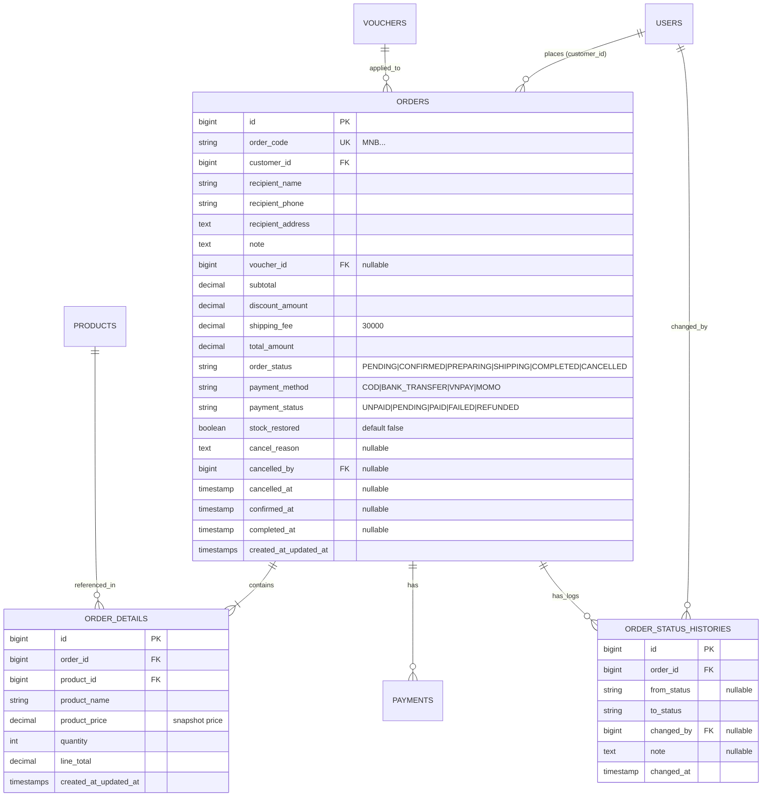

# TÀI LIỆU ĐẶC TẢ YÊU CẦU NGHIỆP VỤ & BRAINSTORMING KẾ HOẠCH PHÁT TRIỂN
## DỰ ÁN: WEBSITE THƯƠNG MẠI ĐIỆN TỬ MẬT NGỌT BEAR
**Phân hệ phụ trách:** Đơn hàng (Order), Quản trị hệ thống (Admin/Staff Management) & Báo cáo Doanh thu (Analytics)  
**Thành viên thực hiện:** **Anh Vũ** (Người 4)  
**Framework & Tech Stack:** Laravel 11 / 12, MySQL, Blade Template, Tailwind CSS, Alpine.js

> File chi tiết đã được lưu tại: [docs/brainstorming_anh_vu.md](file:///d:/HUNRE/Ecommerce/matngotbear/docs/brainstorming_anh_vu.md)

---

## MỤC LỤC
1. [Tổng quan Dự án & Bối cảnh](#1-tổng-quan-dự-án--bối-cảnh)
2. [Phạm vi Công việc của Anh Vũ (Người 4)](#2-phạm-vi-công-việc-của-anh-vũ-người-4)
3. [Thiết kế CSDL & Mô hình Thực thể liên quan](#3-thiết-kế-csdl--mô-hình-thực-thể-liên-quan)
4. [Đặc tả Chi tiết Logic Nghiệp vụ Backend](#4-đặc-tả-chi-tiết-logic-nghiệp-vụ-backend)
5. [Thiết kế Giao diện Frontend (Blade Views)](#5-thiết-kế-giao-diện-frontend-blade-views)
6. [Ma trận Tích hợp Liên Module (4 Thành viên)](#6-ma-trận-tích-hợp-liên-module-4-thành-viên)
7. [Quy chuẩn Git & Quy trình Phát triển Nhánh](#7-quy-chuẩn-git--quy-trình-phát-triển-nhánh)
8. [Checklist Kế hoạch Thực hiện & Milestones](#8-checklist-kế-hoạch-thực-hiện--milestones)

---

## 1. TỔNG QUAN DỰ ÁN & BỐI CẢNH

**Mật Ngọt Bear** là hệ thống thương mại điện tử chuyên cung cấp sản phẩm gấu bông, quà tặng trực tuyến. Hệ thống được xây dựng theo kiến trúc phân quyền 3 vai trò:
- **Customer (Khách hàng):** Xem sản phẩm, tìm kiếm, lọc, giỏ hàng, áp mã voucher, thanh toán checkout, theo dõi đơn hàng, đánh giá sản phẩm đã mua, nhắn tin hỗ trợ.
- **Staff (Nhân viên vận hành):** Tiếp nhận đơn hàng, xử lý cập nhật trạng thái đơn, xác nhận thanh toán (COD, QR/Chuyển khoản), trả lời tin nhắn hỗ trợ khách hàng.
- **Admin (Quản trị viên):** Quản lý sản phẩm, danh mục, voucher, quản lý tài khoản người dùng (Customer, Staff), quản lý review và xem dashboard thống kê doanh thu.

---

## 2. PHẠM VI CÔNG VIỆC CỦA ANH VŨ (NGƯỜI 4)

Theo bảng phân công trong tài liệu đặc tả, **Anh Vũ** phụ trách toàn bộ chu trình xử lý đơn hàng từ khi hoàn tất checkout cho đến khi đơn hoàn thành, cùng với các chức năng quản trị và báo cáo thống kê:

```
                                  PHÂN HỆ CÔNG VIỆC CỦA ANH VŨ
                                                │
    ┌───────────────────────────────────────────┼───────────────────────────────────────────┐
    ▼                                           ▼                                           ▼
[CUSTOMER ORDER MODULE]                 [STAFF ORDER MODULE]                [ADMIN & ANALYTICS MODULE]
• Lịch sử đơn hàng của tôi              • Dashboard tiếp nhận đơn           • Dashboard thống kê tổng quan
• Xem chi tiết & Timeline đơn hàng      • Quản lý & lọc danh sách đơn       • Báo cáo doanh thu Ngày/Tháng/Năm
• Khách tự hủy đơn khi PENDING          • Cập nhật trạng thái đơn hàng      • Quản lý tài khoản Customer (Khóa/Mở)
                                        • Hủy đơn kèm lý do chi tiết        • Quản lý & tạo tài khoản Staff
```

### Danh mục công việc chính:
1. **Order & Order Detail:** Khởi tạo đơn hàng từ giỏ hàng, snapshot giá sản phẩm, cộng phí vận chuyển cố định (30.000 VNĐ), áp dụng voucher giảm giá.
2. **Order State Machine:** Kiểm soát luồng chuyển trạng thái đơn hàng chặt chẽ: `PENDING` $\rightarrow$ `CONFIRMED` $\rightarrow$ `PREPARING` $\rightarrow$ `SHIPPING` $\rightarrow$ `COMPLETED` / `CANCELLED`.
3. **Order Status History:** Lưu nhật ký vết thay đổi trạng thái (ai đổi, đổi lúc nào, ghi chú lý do gì).
4. **Hủy đơn & Hoàn tồn kho (Restore Stock):** Xử lý hủy đơn theo đúng phân quyền (Khách chỉ hủy khi `PENDING`, Staff/Admin hủy khi `PENDING`/`CONFIRMED`), tự động hoàn lại số lượng tồn kho và đảm bảo **chỉ hoàn kho duy nhất 1 lần**.
5. **Staff Order Operations:** Cung cấp giao diện & API để Staff xử lý đơn hàng nhanh chóng, tìm kiếm, lọc theo ngày/trạng thái/hình thức thanh toán.
6. **Admin User Management:** Quản lý danh sách Customer và Staff, xem lịch sử đơn của khách, khóa/mở khóa tài khoản, cấp tài khoản cho Staff.
7. **Báo cáo Thống kê Doanh thu:** Thống kê doanh thu theo mốc thời gian, thống kê số đơn theo trạng thái, tìm top sản phẩm bán chạy.

---

## 3. THIẾT KẾ CSDL & MÔ HÌNH THỰC THỂ LIÊN QUAN



---

## 4. ĐẶC TẢ CHI TIẾT LOGIC NGHIỆP VỤ BACKEND

### 4.1. Quy trình Tạo Đơn Hàng (`createOrder`)
1. **Bọc Transaction:** Toàn bộ quá trình tạo đơn phải chạy trong `DB::transaction()` để đảm bảo toàn vẹn dữ liệu.
2. **Khóa bản ghi sản phẩm & Kiểm tra tồn kho:** Dùng `Product::lockForUpdate()` để tránh xung đột mua hàng đồng thời (Race Condition). Nếu $Tồn\ kho < Số\ lượng\ mua$, `throw Exception`.
3. **Snapshot thông tin sản phẩm:** Ghi lại `product_name`, `product_price` vào bảng `order_details`.
4. **Trừ tồn kho:** Gọi `$product->decrement('stock_quantity', $quantity)`.
5. **Tính toán chi phí:**
   $$\text{Total Amount} = \text{Subtotal} - \text{Discount Amount} + 30.000\text{đ (Phí ship)}$$
6. **Khởi tạo Order & Log lịch sử:** Tạo Order với `order_status = 'PENDING'`, `payment_status = 'UNPAID'`, ghi 1 dòng vào `order_status_histories`.

### 4.2. Vòng đời Trạng thái Đơn hàng (State Machine)

```
                            [ PENDING ] (Chờ xác nhận)
                                 │
              ┌──────────────────┼──────────────────┐
              ▼                  │                  ▼
        [ CANCELLED ]            │            [ CANCELLED ]
      (Khách hàng hủy)           ▼           (Staff/Admin hủy)
                          [ CONFIRMED ] (Đã xác nhận)
                                 │                  │
                                 ▼                  ▼
                          [ PREPARING ] ────► [ CANCELLED ]
                        (Đang đóng gói)     (Trường hợp đặc biệt)
                                 │                  │
                                 ▼                  ▼
                           [ SHIPPING ]        [ HOÀN KHO ]
                          (Đang giao hàng)    (stock_restored=true)
                                 │
                                 ▼
                          [ COMPLETED ]
                      (Giao hàng thành công)
                                 │
             ┌───────────────────┴───────────────────┐
             ▼                                       ▼
    [ TÍNH DOANH THU ]                      [ CHO PHÉP REVIEW ]
(Nếu payment_status=PAID)                 (Kim Tuyến tích hợp)
```

**Bảng Chuyển trạng thái hợp lệ:**
| Trạng thái hiện tại | Trạng thái tiếp theo cho phép | Người có quyền thực hiện |
| :--- | :--- | :--- |
| `PENDING` | `CONFIRMED`, `CANCELLED` | Customer (chỉ hủy), Staff, Admin |
| `CONFIRMED` | `PREPARING`, `CANCELLED` | Staff, Admin |
| `PREPARING` | `SHIPPING`, `CANCELLED` | Staff, Admin |
| `SHIPPING` | `COMPLETED`, `CANCELLED` (giao thất bại) | Staff, Admin |
| `COMPLETED` | *Trạng thái kết thúc* (không được đổi) | Không ai |
| `CANCELLED` | *Trạng thái kết thúc* (không được đổi) | Không ai |

### 4.3. Logic Hủy đơn & Hoàn tồn kho Idempotent (`restoreStock`)
- Khi chuyển sang `CANCELLED`, hệ thống kiểm tra cờ `$order->stock_restored`.
- Nếu `$order->stock_restored == false`:
  - Lặp qua từng `order_details` và tăng `$detail->product->increment('stock_quantity', $detail->quantity)`.
  - Cập nhật `$order->update(['stock_restored' => true])`.
- Đảm bảo nếu hàm hủy đơn bị gọi lặp lại thì số lượng hàng trong kho không bao giờ bị tăng dư.

### 4.4. Quy tắc Tính Doanh thu (Revenue Analytics)
Doanh thu chỉ được cộng vào báo cáo thống kê khi thỏa mãn cả 2 điều kiện:
$$\text{Ghi nhận Doanh thu} \iff (\text{order\_status} == \text{'COMPLETED'}) \land (\text{payment\_status} == \text{'PAID'})$$
- Thống kê theo ngày (hôm nay / 7 ngày qua).
- Thống kê theo tháng / năm.
- Thống kê số lượng đơn theo từng trạng thái.
- Top sản phẩm bán chạy nhất: tính tổng số lượng `quantity` của sản phẩm trong các đơn hàng đã `COMPLETED`.

---

## 5. THIẾT KẾ GIAO DIỆN FRONTEND (BLADE VIEWS)

### 5.1. Dành cho Customer
- `resources/views/orders/index.blade.php`: Danh sách đơn hàng cá nhân, tab trạng thái (Tất cả, Chờ xác nhận, Đang giao, Đã hoàn thành, Đã hủy).
- `resources/views/orders/show.blade.php`: Chi tiết đơn hàng, timeline trực quan mô tả tiến độ giao hàng, địa chỉ nhận hàng, chi tiết giá, nút **Hủy đơn** (chỉ hiển thị khi đơn là `PENDING`).

### 5.2. Dành cho Staff
- `resources/views/staff/dashboard.blade.php`: Các card thống kê nhanh (Số đơn mới cần duyệt, số đơn đang đóng gói, số đơn đang giao).
- `resources/views/staff/orders/index.blade.php`: Bảng quản lý đơn hàng chuyên dụng cho nhân viên, tìm kiếm theo mã đơn / tên khách / SĐT, bộ lọc trạng thái, lọc phương thức thanh toán.
- `resources/views/staff/orders/show.blade.php`: Chi tiết đơn, thông tin thanh toán, khu vực cập nhật trạng thái đơn (nút chuyển nhanh sang bước tiếp theo) và modal nhập lý do hủy đơn.

### 5.3. Dành cho Admin
- `resources/views/admin/dashboard.blade.php`: Dashboard quản trị tổng hợp doanh thu, biểu đồ doanh thu theo thời gian, biểu đồ trạng thái đơn hàng.
- `resources/views/admin/users/index.blade.php`: Quản lý tài khoản Customer (tìm kiếm, xem lịch sử mua hàng, nút Khóa/Mở khóa tài khoản).
- `resources/views/admin/staffs/index.blade.php`: Quản lý tài khoản Staff, form tạo tài khoản nhân viên mới.
- `resources/views/admin/reports/revenue.blade.php`: Báo cáo doanh thu chi tiết với bộ lọc ngày bắt đầu - ngày kết thúc, xuất báo cáo tổng kết.

---

## 6. MA TRẬN TÍCH HỢP LIÊN MODULE (4 THÀNH VIÊN)

```
┌──────────────────────────────────────────────────────────────────────────────────────────────────┐
│                                    SƠ ĐỒ TÍCH HỢP TOÀN HỆ THỐNG                                  │
└──────────────────────────────────────────────────────────────────────────────────────────────────┘

        [ Khánh Vân (Người 2) ]                          [ Ngọc Anh (Người 3) ]
        • Quản lý Product, Stock                         • Quản lý Cart, Voucher, Payment
                     │                                                │
                     │ Cung cấp Product/Stock                         │ Gọi OrderService::createOrder()
                     ▼                                                ▼
        ┌──────────────────────────────────────────────────────────────────┐
        │                         ANH VŨ (Người 4)                         │
        │ • Order, OrderDetail, Status History Management                  │
        │ • State Transition Machine & Stock Restoration                   │
        │ • Staff Operations Dashboard & Admin User/Revenue Analytics      │
        └──────────────────────────────────────────────────────────────────┘
                     │
                     │ Cung cấp điều kiện Order COMPLETED & sold_count
                     ▼
        [ Kim Tuyến (Người 1) ]
        • Kiểm tra quyền viết Review sản phẩm
        • User Auth & Khách hàng
```

| Thành viên | Phân hệ phụ trách | Điểm kết nối với Anh Vũ |
| :--- | :--- | :--- |
| **Ngọc Anh (Người 3)** | Giỏ hàng, Voucher, Thanh toán | Khi khách bấm đặt hàng tại trang Checkout, Ngọc Anh gọi `OrderService::createOrder($orderData, $cartItems)`. Ngọc Anh không tự lưu bảng Orders. |
| **Kim Tuyến (Người 1)** | Tài khoản & Review | Khi khách hàng muốn viết Review sản phẩm, Kim Tuyến gọi kiểm tra: Phải tồn tại `Order` của khách có trạng thái `COMPLETED` chứa sản phẩm đó. |
| **Khánh Vân (Người 2)** | Sản phẩm & Tồn kho | Khi Order hoàn thành (`COMPLETED`), `OrderService` cập nhật tăng `sold_count` cho Product để Khánh Vân hiển thị mục "Sản phẩm bán chạy" ở Trang chủ. Khi Order bị hủy (`CANCELLED`), `OrderService` hoàn lại `stock_quantity`. |

---

## 7. QUY CHUẨN GIT & QUY TRÌNH PHÁT TRIỂN NHÁNH

1. **Nguyên tắc vàng:** Không commit/push trực tiếp vào nhánh `main`.
2. **Quy trình tạo nhánh:**
   ```bash
   # Cập nhật mã nguồn mới nhất từ remote
   git checkout main
   git pull origin main

   # Tạo nhánh tính năng riêng cho Anh Vũ
   git checkout -b feature/order-management
   ```
3. **Quy chuẩn đặt tên nhánh cho các module của Anh Vũ:**
   - `feature/order-service-core` : Hoàn thiện logic OrderService, hủy đơn, hoàn kho.
   - `feature/customer-order-views`: Giao diện lịch sử đơn hàng & chi tiết đơn của khách.
   - `feature/staff-order-management`: Dashboard & giao diện quản lý đơn cho Staff.
   - `feature/admin-users-analytics`: Quản lý tài khoản Customer/Staff & Báo cáo doanh thu.
4. **Không xóa hay sửa đổi đè file của thành viên khác:** Nếu có chỉnh sửa chung ở `routes/web.php` hoặc `database/migrations`, cần thảo luận trước để tránh merge conflict.

---

## 8. CHECKLIST KẾ HOẠCH THỰC HIỆN & MILESTONES

### Giai đoạn 1: Hoàn thiện Lõi Backend & Business Service (✅ Đã hoàn thành 100%)
- [x] Thiết kế Database Schema (`orders`, `order_details`, `order_status_histories`).
- [x] Tạo các Models: `Order`, `OrderDetail`, `OrderStatusHistory` với đầy đủ Relationship.
- [x] Hoàn thiện `App\Services\OrderService`:
  - [x] `createOrder()` với Transaction, Lock For Update, trừ kho, tính voucher và ship.
  - [x] `cancelOrder()` kiểm tra quyền hủy, đổi trạng thái và ghi log.
  - [x] `updateStatus()` chuyển đổi trạng thái đơn và cập nhật timestamp tương ứng.
  - [x] `restoreStock()` hoàn tồn kho an toàn với cờ `stock_restored`.
  - [x] `increment('sold_count')` khi đơn chuyển sang `COMPLETED`.

### Giai đoạn 2: Controllers & Xử lý Yêu cầu HTTP (✅ Đã hoàn thành 100%)
- [x] `App\Http\Controllers\Customer\OrderController`:
  - [x] `index()`: Lấy danh sách đơn hàng của `auth()->user()`.
  - [x] `show($id)`: Xem chi tiết đơn hàng kèm timeline trạng thái.
  - [x] `cancel($id)`: Khách yêu cầu tự hủy đơn khi trạng thái là `PENDING`.
- [x] `App\Http\Controllers\Staff\OrderController`:
  - [x] `index()`: Danh sách đơn hàng với phân trang, bộ lọc trạng thái.
  - [x] `show($id)`: Chi tiết đơn hàng cho nhân viên xử lý.
  - [x] `updateStatus($id)`: Chuyển trạng thái đơn sang bước tiếp theo.
  - [x] `cancel($id)`: Staff hủy đơn kèm lý do.
- [x] `App\Http\Controllers\Staff\DashboardController`:
  - [x] Thống kê số đơn chờ, đơn đang xử lý, doanh thu hôm nay và danh sách đơn mới.
- [x] `App\Http\Controllers\Admin\UserController`:
  - [x] `index()`: Danh sách khách hàng và nhân viên.
  - [x] `updateStatus($id)`: Khóa / mở khóa tài khoản người dùng (`ACTIVE` / `BLOCKED`).
  - [x] `updateRole($id)`: Cập nhật vai trò người dùng (`CUSTOMER`, `STAFF`, `ADMIN`).
- [x] `App\Http\Controllers\Admin\DashboardController`:
  - [x] Thống kê tổng doanh thu (`COMPLETED` + `PAID`), tổng đơn, đơn theo trạng thái.
  - [x] Thống kê biểu đồ doanh thu 12 tháng qua.
  - [x] Thống kê danh sách Top 10 sản phẩm bán chạy nhất (`sold_count`).

### Giai đoạn 3: Xây dựng Giao diện Blade & Tương tác UI (⏳ Đang tiến hành)
- [ ] Giao diện Khách hàng:
  - [ ] `resources/views/customer/orders/index.blade.php`: Danh sách đơn & tab trạng thái.
  - [ ] `resources/views/customer/orders/show.blade.php`: Chi tiết đơn hàng, timeline giao vận, nút Hủy đơn.
- [ ] Giao diện Nhân viên (Staff):
  - [ ] `resources/views/staff/dashboard/index.blade.php`: Dashboard vận hành xử lý đơn.
  - [ ] `resources/views/staff/orders/index.blade.php`: Bảng đơn hàng có bộ lọc & tìm kiếm.
  - [ ] `resources/views/staff/orders/show.blade.php`: Chi tiết đơn & form đổi trạng thái đơn.
- [ ] Giao diện Quản trị (Admin):
  - [ ] `resources/views/admin/dashboard/index.blade.php`: Dashboard biểu đồ thống kê & doanh thu.
  - [ ] `resources/views/admin/users/index.blade.php`: Giao diện quản lý tài khoản người dùng.

### Giai đoạn 4: Tích hợp Liên Module & Kiểm thử Toàn diện (E2E Testing)
- [ ] Kết nối luồng Checkout của Ngọc Anh vào `OrderService::createOrder`.
- [ ] Kết nối luồng Đánh giá của Kim Tuyến với kiểm tra đơn hàng `COMPLETED`.
- [ ] Kiểm thử luồng hoàn kho khi hủy đơn ở các trường hợp (Khách hủy, Staff hủy).
- [ ] Kiểm thử tính chính xác của báo cáo thống kê doanh thu (chỉ tính đơn `COMPLETED` + `PAID`).

### Giai đoạn 4: Tích hợp Liên Module & Kiểm thử Toàn diện (E2E Testing)
- [ ] Kết nối luồng Checkout của Ngọc Anh vào `OrderService::createOrder`.
- [ ] Kết nối luồng Đánh giá của Kim Tuyến với kiểm tra đơn hàng `COMPLETED`.
- [ ] Kiểm thử luồng hoàn kho khi hủy đơn ở các trường hợp (Khách hủy, Staff hủy).
- [ ] Kiểm thử tính chính xác của báo cáo thống kê doanh thu (chỉ tính đơn `COMPLETED` + `PAID`).
